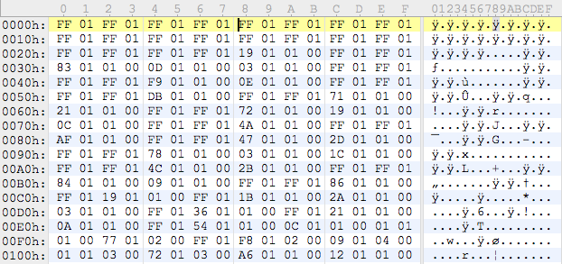
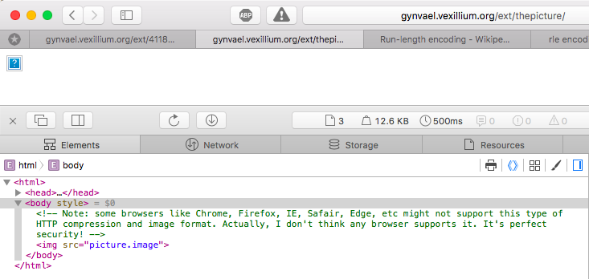
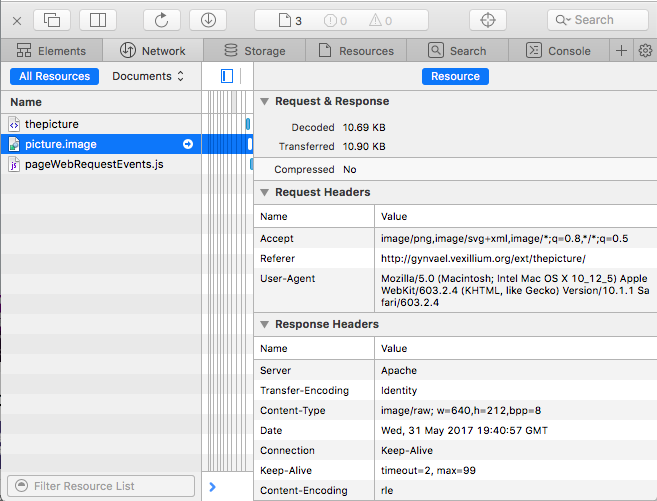
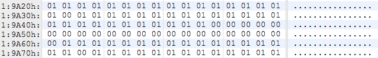
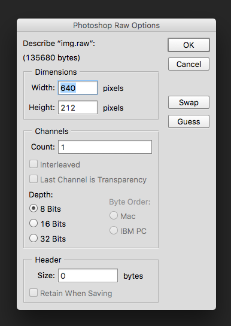
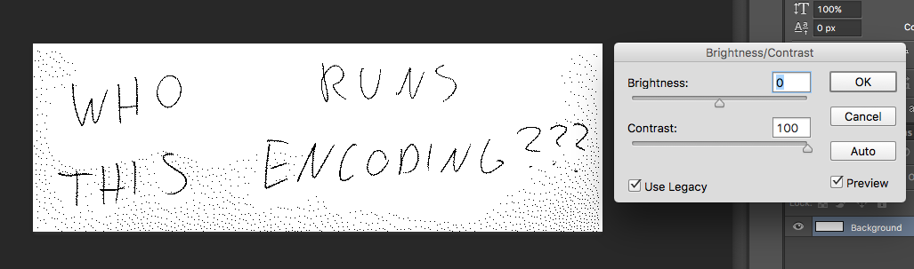

# Writeup of MISSION 005 by Gynvael

[Task text](http://gynvael.vexillium.org/ext/4118eb92fe0799f5b5e73c1e1efee294df2ec872.txt)

[Site](http://gynvael.vexillium.org/ext/thepicture/)

Step -1: download image and stare at it in hex editor to no effect for 5 minutes.



View source:



*HTTP compression and image format*... Let's open janky Safari network inspector and view picture headers:



Yeah, [RLE](https://en.wikipedia.org/wiki/Run-length_encoding), raw image 640x212@8bits, got it. Simple decoder in python3:

```python
with open('picture.image', 'rb') as f:
    img = f.read()

i = 0
res = bytearray()

for i in range(0, len(img), 2):
    n, b = img[i:i + 2]
    res.extend(bytes((b,)) * n)

with open('img.raw', 'wb') as f:
    f.write(res)
```

Open uncompressed image and look at it in hex editor...



Alright, this is very low contrast.

Open in Photoshop with right params:



Contrast to the max(use legacy for harsher, non-artistic contrast) and here it is.


