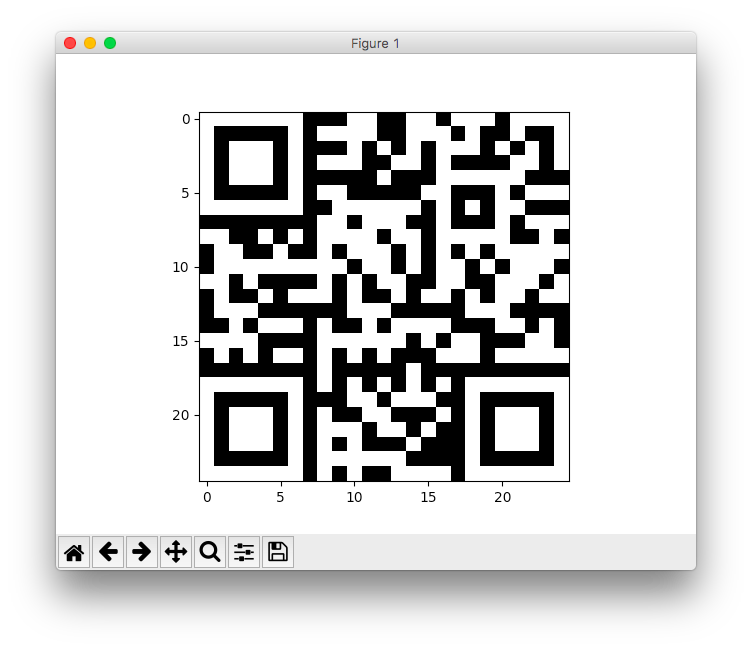

# Writeup of MISSION 006 by Gynvael

[Task text](http://gynvael.vexillium.org/ext/4118eb92fe0799f5b5e73c1e1efee294df2ec872_mission006.txt)

[Data](http://goo.gl/S395x6)

This is my whole solution process, if anyone's interested... **Bold** is for key ideas, *Italic* is for dead ends.

Alright, opened data, and since I have no idea what this means I put it in python file for further inspection.

*Note: 338 items*

While I was busy adding commas and wrapping this whole thing in brackets I noticed: **pairs of 2 numbers = coordinates? I need matplotlib for that.** Sadly I hardly know anything about matplotlib, besides that it can plot some mat;)

Right, before we begin reading tutorials let's do some analysis:

```python
from operator import itemgetter

x = list(map(itemgetter(0), data))  # I don't know why I originally did it like this...
y = [item[1] for item in data]      # This is shorter, more readable and probably faster

x, y = zip(*data)  # But this is the most elegant solution
```

Anyway, we got our x and y coords(?), let's do some analysis

```python
print(min(x), min(y))  #  0  0
print(max(x), max(y))  # 24 24

# What? Yes, I called that analysis ;)
```

*Both x and y are in [0,24] range... Look at sum/difference? Idk*

Alright, these are probably coordinates. Google "matplotlib plot dots". Respect for [great tutorial](https://matplotlib.org/users/pyplot_tutorial.html)

```python
import matplotlib.pyplot as plt
plt.plot(x, y, 'ro')
plt.axis([0, 26, 0, 26])
plt.show()
```


**Oh, that's a QR code!** Yay)

Google "python paint bitmap matplotlib" (damn [that tutorial](https://matplotlib.org/users/image_tutorial.html) is good)

Google "numpy create array of zeros" (I don't use NP that often). [numpy.zeros](https://docs.scipy.org/doc/numpy/reference/generated/numpy.zeros.html), duh.

```python
import numpy as np

qr = np.zeros((25, 25))
for x, y in data:
    qr[x, y] = 1
imgplot = plt.imshow(qr)
plt.show()
```


Ahem, that's weird color pallet. Google "matplotlib plot grayscale". [Thanks, stackoverflow](https://stackoverflow.com/questions/3823752/display-image-as-grayscale-using-matplotlib)

```python
import numpy as np

qr = np.zeros((25, 25))
for x, y in data:
    qr[x, y] = 1
imgplot = plt.imshow(qr, cmap='gray')
plt.show()
```



Yep, that's better, but inverted (because I was painting coordinates white, facepalm). I'm gonna guess that there is numpy.ones...

```python
import numpy as np

qr = np.ones((25, 25))
for x, y in data:
    qr[x, y] = 0
imgplot = plt.imshow(qr, cmap='gray')
plt.show()
```


It's still mirrored, nevertheless I just tried to scan it and it worked rigth away with [Workflow's](https://itunes.apple.com/ru/app/workflow-powerful-automation-made-simple/id915249334?mt=8) QR scanner and [Kaspersky's QR Scanner](https://www.kaspersky.com/qr-scanner), but [it's easy](https://stackoverflow.com/a/8280500) to mirror it if your scanner isn't that smart:

```python
import numpy as np

qr = np.ones((25, 25))
for x, y in data:
    qr[x, y] = 0
imgplot = plt.imshow(qr, cmap='gray')

plt.gca().invert_yaxis()
plt.show()
```


## Quick aside on QR codes

You all probably know, that QR codes contain big obvious markers for tracking: the 3 corner targets. Also, there is fourth smaller target (it's somewhat offset from corner for better 3D tracking. It can be missing on smaller QR codes and occur more than once on larger ones) and striped lines between 3 corner targets (for establishing resolution of that qr code). If you can't scan QR code - check those markers, perhaps a couple of lines were inverted by some evil task author ;)


Ones again I'd like to thank Gynvael for informative streams and fun challenges.