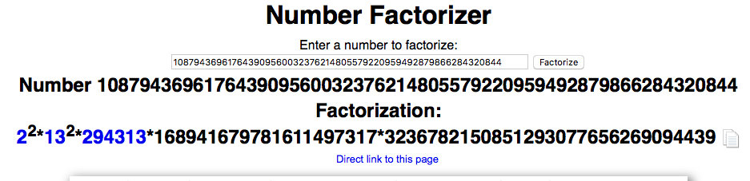

# Writeup of MISSION 008 by Gynvael
```
Welcome back agent 1336.
No mail.
> mission --take
MISSION 008               goo.gl/urZsGS             DIFFICULTY: ██░░░░░░░░ [2╱10]
┅┅┅┅┅┅┅┅┅┅┅┅┅┅┅┅┅┅┅┅┅┅┅┅┅┅┅┅┅┅┅┅┅┅┅┅┅┅┅┅┅┅┅┅┅┅┅┅┅┅┅┅┅┅┅┅┅┅┅┅┅┅┅┅┅┅┅┅┅┅┅┅┅┅┅┅┅┅┅┅┅

Oh great. We received another message. "It's plaintext" - that's what he told us.
We knew better, but we still had hope that it will actually be plaintext. It 
wasn't. It was just this huge number:

    1087943696176439095600323762148055792209594928798662843208446383247024

We called the agent and asked about it. Calmly. We didn't yell. Not at all. Maybe
A little.

He told us it was plaintext. He just multiplied it by an unknown number. We will
just give it to you to decipher.

On a more positive note, we have two new agents in training.

GOOD LUCK!

If you decode the answer, put it in the comments under this video! If you write
a blogpost / post your solution online, please add a link in the comments too!

P.S. I'll show/explain the solution on the stream next week.
P.S.2. It's just two bytes. But there is a plot twist. Expect the unexpected.
```

**WARNING:** For short, sane, optimal solution in just 7 lines of code take a look at [h4stoor's writeup](https://github.com/h4stoor/ctf-writeups/tree/master/GYNVAEL'S_LIVESTREAM/mission008). My solution is overcomplicated, but perhaps you can learn from my mistakes or take away something useful from the code.

### Solution

Alright, we need to factorize this number and go through all combinatinations of prime divisors. Easy.

The task is even easier if you actually *read it*, but I thought this line was just randomly left from the previous challenge:

> P.S.2. It's just two bytes. But there is a plot twist. Expect the unexpected.


### One giant failure

Let's use mighty online tools! Wolfram is probably gonna ask to buy premium since this is a pretty large number *[this is wrong, WolframAlpha happily factorized the number. Never doubt the power of WolframAlpha].*

Alright, let's google! [http://www.numberempire.com/numberfactorizer.php](http://www.numberempire.com/numberfactorizer.php) is the top result and it immediatly gives us following factorization:



Do you see the mistake? I didn't. Sadly this site silently truncates our input to 60 characters and our number is 70 characters long. Damn.
```
1087943696176439095600323762148055792209594928798662843208446383247024
108794369617643909560032376214805579220959492879866284320844
```
I proceeded to write correct code, but I ran it on incorrect data. After i got a bunch of gibberish i started randomly fudging code around (reversing byte order, etc). Eventually I re-copied number from the task and noticed the error.

### One overcomplicated solution

Alright, I must factorize the number myself. Googled for "factorize number python", got to the [Almighty StackOverflow](https://stackoverflow.com/questions/6800193/what-is-the-most-efficient-way-of-finding-all-the-factors-of-a-number-in-python) and [learned](https://stackoverflow.com/a/44016550) about `factorint` from `SymPy`.

I ran my original algorithm on the correct factorization and got the answer. [Code is here](./code.py).